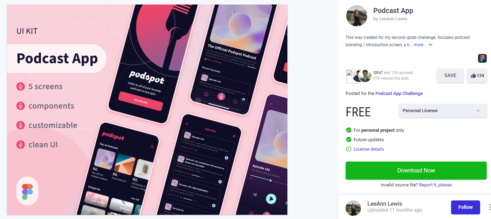
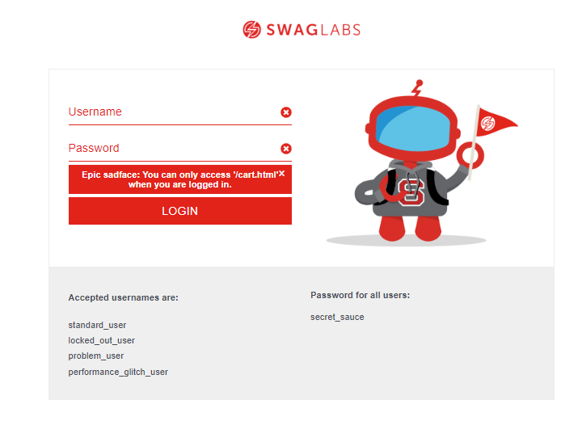

# Portfólio
 

Este projeto tem como finalidade mostrar o meu trabalho de análise de requisitos e plano de teste

Neste repositório você encontrará a analise de dois (2) projetos, sendo:

- Analise de requisitos de um protótipo Figma
- Plano de Teste de um site

## Portfólio Analise de Requisitos

- Protótipo do Figma [PodcastApp](https://www.uplabs.com/posts/podcast-app-27e7dba2-b5d6-40f8-be0f-52d6710b9af7)

## Portifólio Plano de Teste

- Site utilizado para elaboração do Plano de teste [Saucedemo](https://www.saucedemo.com/)

