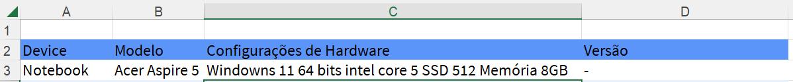

# Projeto Saucedemo

Este projeto foi criado com o propósito de praticar a criação e execução do **plano de teste** de um site já existente, realizando levantando de requisitos, criaçãoo de suites e casos de testes para execução

## Ferramentas

- Site utilizado para elaboração do Plano de teste [Saucedemo](https://www.saucedemo.com/)

-Excell para criação do Plano de Teste

# Plano de Teste

## Apresentação do Plano

Na aba Introdução da Planilha irá conter todas as informações bases do projeto

## Escopo do teste

Na aba do escopo de teste irá conter um sumário das funcionalidades testadas do sistema, sendo uma prévia do que será detalhado na aba suites.

- ID do Requito/Caso de uso: Númeração atribuida ao requerimento e título referenciando o caso de uso.
- Requisto/Caso de uso: Objetivo do caso a partir da visão do usuário.
- Tipo de teste: Combo de seleção para informar qual o tipo de teste foi utilizado.
- Teste por meio de: Combo de seleção para informar por qual meio foi feito a validação dos teste.

## Apresentando a Estratégia de Teste

Nesta aba irá conter um resumo da estratpegia adotada para os testes apresentados.

- Estágio(s): A coluna contém opções para selecionar em qual estágio do teste o plano foi executado.
- Tipo: A coluna contém opçoes para selecionar qual estratégia de teste foi feita, sendo possível selecionar mais de um se for o caso.
- Implementação: A Coluna contém opções para informar como foi feita a execução dos testes, se de forma manual e/ou automática.
- Objetivo: Coluna onde deverá ser informado resumo do objetivo a ser alcaçado.

## Apresentando o Ambiente de Teste

Nesta aba é informado em qual aparelho foi realizado o teste.

## Apresentando o Critério de Aceite

Nesta aba temos a descrição de como foi orquestrado os critérios a serem atendidos nas execução de testes.

## Apresentando Suite

Nas abas Suites será apresentado os critérios de aceite e cenários abordados para realizar os testes referente a funcionalidades descritas.

- Tipo de teste: Funcional, pois o site testado já existe e está sendo válido de as funcionalidades estão conforme se espera.
- Subtipo de teste: Critérios de aceite, pois entende-se que ao ter um site com as funcionalidades entregues, alguns critérios devem estar de acordo com o esperando segundo a visão do usuário.
- Pré Condição: Lista o que é necessário para realizar o teste (massa de teste)
- Requisitos: Objetivo principal da funcionalidade.
- Dados necessários: Descreve quais os dados precisam ser utilizados para que o teste ocorra como esperado.
- ID: Numeração dos cenários abordados na suite.
- Critérios de Aceite: Detalha em qual local do site o usuário está e o que ela fará para atigir o obejtivo esperado.
- Severidade Prioridade: Classificação atribuida ao cenário, conténdo classificações pré estabelecidas que deve ser analisada em conjuto aos demais cenários abordados na suite.
- Resultado Esperado: Informa o que deve ocorrer após o usuário agir.
- Resultado Obtido: Informa o que ocorreu de fato ao executar o teste.
- Defeitos: Havendo erro, aqui será descrito.
- Finalizado: Data da finalização, podendo haver contagem de tempo para mensurar o tempo utilizado. 

